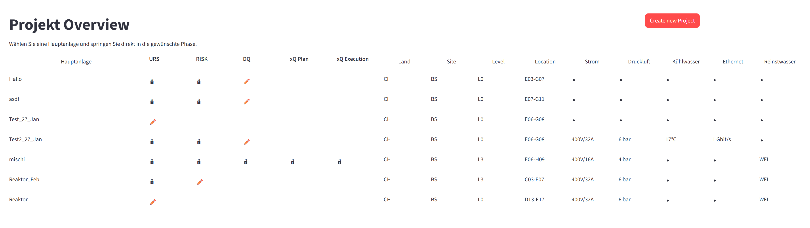
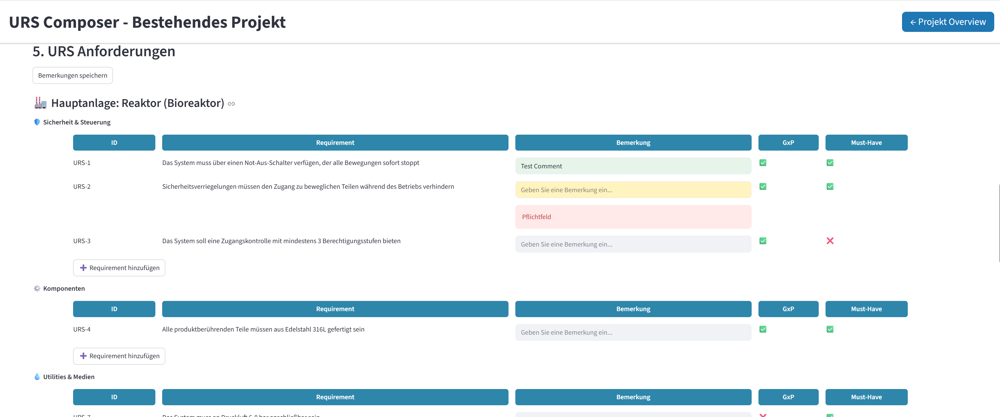
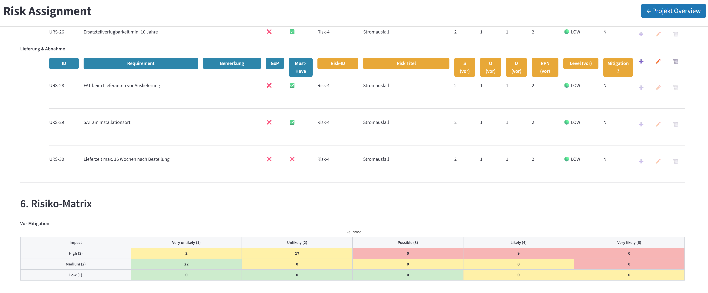
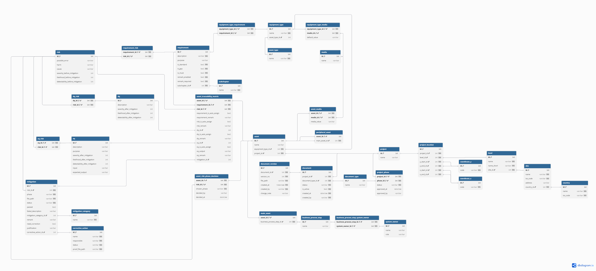

# Compliance Workflow Tool — Equipment Qualification Web App (MVP)

> **Note:** The MVP is actively in development.

---

A Streamlit-based web application for managing the full equipment qualification lifecycle in regulated industries (pharma, biotech, medtech). It guides teams from loading standardized User Requirements Specifications (URS) with manual extensions through risk assessment, design qualification (DQ), and qualification execution (xQ), generating audit-ready PDF documents along the way.

---

## What problem does this solve?

Equipment qualification in regulated environments is documentation-heavy and error-prone when managed in Word/Excel manually. This tool provides a structured, workflow-driven interface that:

- Ensures all requirements are captured and traceable
- Links URS requirements to risk items and qualification tests automatically
- Enforces phase-gate progression so teams can't skip steps
- Generates PDF documents ready for review and approval

---

## Current Status (March 2026)

The following pages and features are implemented:

| Module | Description |
|---|---|
| Project Overview (Dashboard) | Overview of all assets and their current phase |
| URS Composer | Catalog-based requirement assignment, custom URS, PDF export |
| Risk Assessment (FMEA) | Risk catalog, severity/probability scoring, mitigation tracking |
| Design Qualification (DQ) | DQ checklist linked to URS requirements |
| Qualification Plan (xQ Plan) | Test planning linked to URS/risk items |
| Qualification Execution (xQ Execution) | Test execution with pass/fail recording |

---

## Quick Start (Windows)

Follow these steps to run the MVP locally.

### 1. Clone the repository
```bash
git clone https://github.com/hueglij/req-trace-tool.git
cd req-trace-tool
```

### 2. Create and activate a virtual environment
```bash
python -m venv venv
venv\Scripts\activate
```

### 3. Install dependencies
```bash
pip install --upgrade pip
pip install -r requirements.txt
```

### 4. Initialize the project data
Create the initial dummy data required for the application.
```bash
python init_data.py
```

### 5. Start the MVP app
```bash
cd mvp
streamlit run app.py
```
The app will start locally and open in your browser (usually at http://localhost:8501).

### 6. Stop the app
Press:
```bash
CTRL + C
```
in the terminal.

---

## Screenshots

### Dashboard — Project Overview

> *Screenshot: The landing page lists all assets/projects with their current qualification phase. Each row shows sortable columns for location and utilities, plus quick-access buttons to jump into the active phase.*



---

### URS Composer — Requirement Assignment

> *Screenshot: Requirements are loaded from a structured catalog, grouped by subchapter: Safety & Control, Components, Software, etc. and assigned to the asset. Custom requirements can be added inline.*



---

### Risk Assessment — FMEA

> *Screenshot: Each URS requirement has associated risk items. Severity and probability are scored to calculate a risk level (Low / Medium / High), with mitigation status tracking.*



---

### Qualification Execution — Test Results

> *Screenshot: Testers record pass/fail results per test step. The form is locked once the phase is complete.*

<!-- Add screenshot here: xq_execution.png -->

---

### PDF Export

> *Screenshot: Generated qualification document with header, approval block, and structured requirement tables — ready for review.*

<!-- Add screenshot here: pdf_export.png -->

---

## Workflow

```
New Project
     │
     ▼
1. URS  ──── Assign standardized requirements from catalog, add custom items
     │
     ▼
2. Risk ──── FMEA: score severity × probability, define mitigations
     │
     ▼
3. DQ  ──── Design Qualification checklist
     │
     ▼
4. xQ Plan ── Define qualification test cases
     │
     ▼
5. xQ Execution ── Record test results (pass / fail)
     │
     ▼
6. Done ── All sections read-only, documents archived
```
---

## Database Structure
> *Screenshot: ER-diagramm of Database*



---

## Tech Stack

- **Frontend/UI**: [Streamlit](https://streamlit.io/)
- **Data Layer**: currently Excel files (will be changed soon)
- **Language**: Python 3.11+

---

## Roadmap

- [X] Finish xQ Phases
- [ ] Replace Excel data layer with SQLite
- [ ] User authentication and role-based access 
- [ ] Cloud deployment (Streamlit Community Cloud)

---

## About

Built as a small project to solve a real pain point in generating highly standardized URS with relating and repeating risks and qualification tasks. Minimizes the manual workforce by creating standardized documents. 

Feedback and ideas welcome — open an issue or reach out directly.
